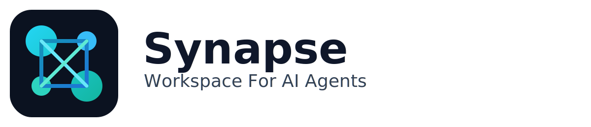
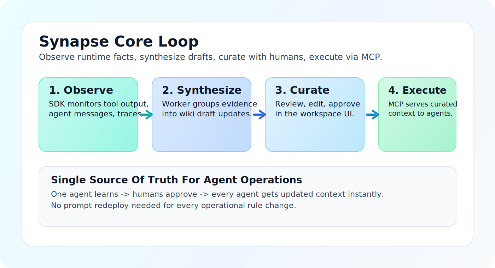

<p align="center">
  
</p>

<p align="center">
  <strong>Synapse: The Agentic Wiki and Cognitive State Layer for AI Agents.</strong><br/>
  Convert ephemeral agent experience into a shared, human-curated source of truth.
</p>

<p align="center">
  <a href="LICENSE"></a>
  <a href="docs/compatibility-matrix.md"></a>
  <a href="docs/compatibility-matrix.md"></a>
  <a href="services/mcp/README.md"></a>
</p>

<p align="center">
  
</p>

## The Problem: "Goldfish AI" In Operations

Most production agent stacks still have three failure modes:

1. **Memory leak**: useful runtime insights disappear after a session ends.
2. **Static RAG drift**: agents rely on stale docs (PDF/Notion) while reality changes daily.
3. **Black-box learning**: business teams cannot see or safely correct what agents "learned".

## The Solution: Agentic Wiki

Synapse is middleware between your agent runtime (OpenClaw, LangGraph, CrewAI, custom stacks) and your operating knowledge.

### Core loop

1. **Observe (SDK)**: capture insights and facts from tool outputs and dialogs.
2. **Synthesize (Weaver)**: convert noisy signals into structured draft wiki updates.
3. **Curate (UI)**: humans review, edit, approve, or reject drafts.
4. **Execute (MCP)**: approved knowledge becomes live runtime context for all agents.

This is your live **single source of truth** for agent behavior.

## Synapse For OpenClaw Agents

Give OpenClaw agents a long-term collaborative brain.

### Why Synapse + OpenClaw

- **Persistence**: agents remember facts across sessions.
- **Shared intelligence**: what one agent learns, all agents can use.
- **Human oversight**: operators approve/edit knowledge in a wiki workflow.

### Quick Start (OpenClaw)

Install Python SDK:

```bash
pip install synapse-sdk
```

Connect Synapse to OpenClaw:

```python
from synapse_sdk import Synapse, SynapseConfig
from synapse_sdk.integrations.openclaw import OpenClawConnector

synapse = Synapse(
    SynapseConfig(
        api_url="http://localhost:8080",
        project_id="water_delivery_logistics",
    )
)

connector = OpenClawConnector(
    synapse,
    search_knowledge=lambda query, limit, filters: my_knowledge_search(query, limit, filters),
)
connector.attach(openclaw_runtime)
```

Your runtime gets OpenClaw tools:
- `synapse_search_wiki`
- `synapse_propose_to_wiki`
- `synapse_get_open_tasks`
- `synapse_update_task_status`

TypeScript OpenClaw plugin package: `@synapse/openclaw-plugin`  
Source path: [packages/synapse-openclaw-plugin](packages/synapse-openclaw-plugin)

## Product Capabilities

- **Semantic Diff**: show how understanding changed before approval.
- **Conflict Resolution**: detect and route contradictory claims.
- **Agentic Onboarding**: bootstrap from existing runtime memory on day 0.
- **No-code Knowledge Injection**: update wiki facts and change agent behavior without prompt redeploy.
- **Task-aware execution**: link operational tasks to drafts, pages, and evidence.

## 5-Minute Local Proof

Run the full core loop (`ingest -> draft -> approve -> MCP retrieval`):

```bash
./scripts/run_selfhost_core_acceptance.sh
```

Or use CLI onboarding:

```bash
python3 -m venv .venv
source .venv/bin/activate
pip install -e packages/synapse-sdk-py
synapse-cli quickstart --dir . --project-id omega_demo --api-url http://localhost:8080 --doctor-strict --verify-core-loop
```

Run local workspace UI:

```bash
cp .env.selfhost.example .env.selfhost
docker compose --env-file .env.selfhost -f infra/docker-compose.selfhost.yml up -d --build
cd apps/web && npm install && npm run dev
```

Open `http://localhost:5173`.

Lock workspace to focused core workflow (hide advanced mode and expert toggles):

```bash
export VITE_SYNAPSE_UI_PROFILE=core-only
```

## Open-Core Stack

### Synapse Core (OSS)

- SDKs: [packages/synapse-sdk-py](packages/synapse-sdk-py), [packages/synapse-sdk-ts](packages/synapse-sdk-ts)
- Knowledge engine + API: [services/api](services/api)
- Synthesizer worker: [services/worker](services/worker)
- MCP runtime: [services/mcp](services/mcp)
- Local wiki workspace UI: [apps/web](apps/web)
- Canonical schemas: [packages/synapse-schema](packages/synapse-schema)

### Cloud / Enterprise Direction

- Multi-tenancy and RBAC
- Expert approval workflows and notifications
- Advanced analytics and ROI reporting
- Full audit trail and governance controls

## Docs

- Getting started: [docs/getting-started.md](docs/getting-started.md)
- OpenClaw integration: [docs/openclaw-integration.md](docs/openclaw-integration.md)
- Wiki engine design: [docs/wiki-engine-design.md](docs/wiki-engine-design.md)
- MCP runtime: [docs/mcp-runtime.md](docs/mcp-runtime.md)
- Legacy import and sync: [docs/legacy-import.md](docs/legacy-import.md), [docs/legacy-sync-orchestration.md](docs/legacy-sync-orchestration.md)
- Tutorials: [docs/tutorials/README.md](docs/tutorials/README.md)
- SDK API reference: [docs/reference/README.md](docs/reference/README.md)

## Demos

- OpenClaw onboarding kit: [demos/openclaw_onboarding/README.md](demos/openclaw_onboarding/README.md)
- End-to-end Omega scenario: [demos/omega_gate/README.md](demos/omega_gate/README.md)
- Cookbook examples: [demos/cookbook/README.md](demos/cookbook/README.md)

## OSS, Security, Release

- Contributing: [CONTRIBUTING.md](CONTRIBUTING.md)
- Security policy: [SECURITY.md](SECURITY.md)
- Release workflow: [docs/release-workflow.md](docs/release-workflow.md)
- OSS publish checklist: [docs/oss-publish-checklist.md](docs/oss-publish-checklist.md)
- License: [LICENSE](LICENSE)
