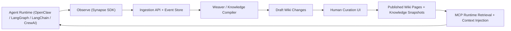
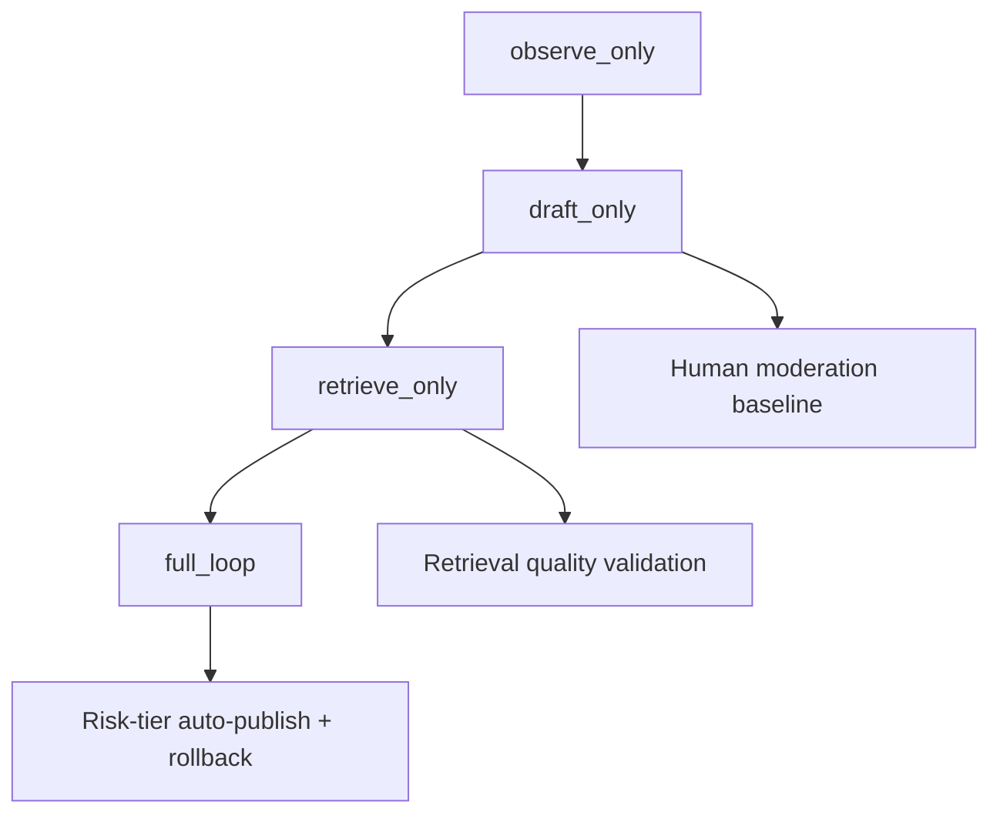
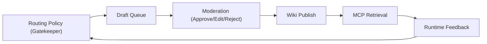

# Synapse Architecture Diagram Pack

Last updated: 2026-04-04

## 1) Core Loop (Observe -> Synthesize -> Curate -> Execute)

## 2) Raw RAG vs Synapse L2

| Dimension | Raw RAG on static docs | Synapse L2 cognitive state layer |
| --- | --- | --- |
| Freshness | Depends on manual document updates | Continuously updated from agent observations + curation |
| Governance | Coarse, document-level | Statement/page-level approvals and rollback |
| Explainability | Weak source-to-answer traceability | Evidence-linked drafts, revisions, moderation timeline |
| Runtime fit | Keyword/embedding retrieval only | Intent-aware retrieval with policy/process constraints |
| Multi-agent sharing | Indirect and inconsistent | Shared published wiki knowledge across all connected agents |

## 3) Adoption Sequence

## 4) Governance Overlay

